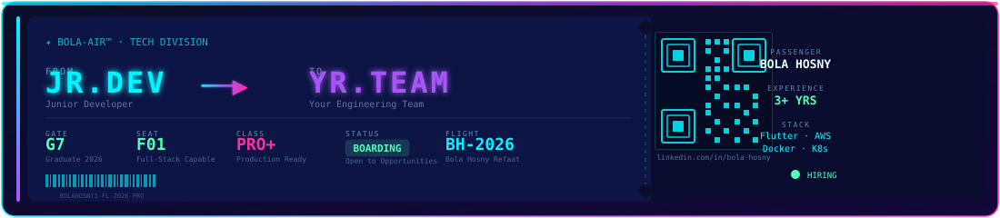
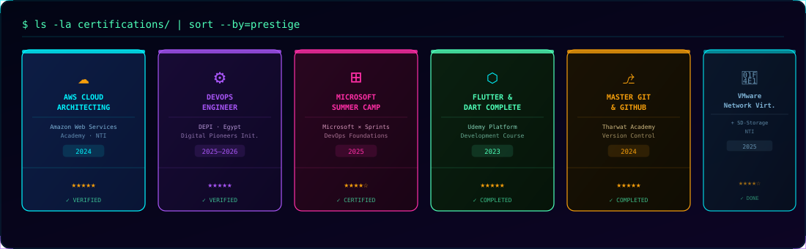

<div align="center">



<br/>

<a href="https://www.linkedin.com/in/bola-hosny">

</a>

</div>

---

<div align="center">

```
$ system.log --tail=10 --persona=BolaOS --scan=true
```

</div>

<div align="center">

> `[BolaOS-AI]` 🔍 Scanning developer signature... **MATCH FOUND**
>
> `[BolaOS-AI]` 📱 Flutter proficiency: **CRITICAL HIGH** — Clean Architecture, BLoC, MVVM across 3+ shipped apps
>
> `[BolaOS-AI]` ☁️ Cloud subsystems: AWS · Docker · Kubernetes · CI/CD — **ALL ACTIVE**
>
> `[BolaOS-AI]` 🧩 Problem-solving cores: **150+ Codeforces problems** indexed · ECPC Competitor 2024–2025
>
> `[BolaOS-AI]` 🎓 Education module: CS Degree · Faculty of Computers & Information, Future Academy Cairo — **GRADUATING 2026**
>
> `[BolaOS-AI]` 🏆 Achievement unlocked: **Top 20 Graduates** — ITIDA × NTI Summer Training Program
>
> `[BolaOS-AI]` ⚡ Stack fingerprint: `Dart` `Python` `C++` `Bash` `SQL` — multi-language polyglot detected
>
> `[BolaOS-AI]` 🚀 Recommendation: **`hire --priority=urgent --role="Flutter · Cloud Engineer"`**
>
> `[BolaOS-AI]` ✅ Scan complete. **Candidate is production-ready.** Initiating recruiter handshake...

</div>

---

<div align="center">

```
$ cat boarding_pass.txt  # The flight that started it all
```



</div>

---

<div align="center">

```
$ whoami
```

</div>

### 👤 About

> Software Engineer specializing in **Flutter** mobile development with a deep foundation in **Cloud Computing** and **DevOps**. I build production-grade apps using Clean Architecture, BLoC, and Firebase — then ship them to the cloud with Docker, Kubernetes, and AWS. I don't just write code; I architect systems.
>
> Currently completing a **DevOps Engineer Trainee** program (DEPI × Egypt) while pursuing my CS degree, graduating 2026.

<div align="center">

`🧠 role: Software Engineer` &nbsp;•&nbsp; `📱 focus: Flutter + Dart` &nbsp;•&nbsp; `☁️ background: AWS · Docker · K8s` &nbsp;•&nbsp; `🔥 mindset: Ship. Learn. Iterate.`

</div>

---

<div align="center">

```
$ cat education.log --format=structured
```

</div>

<table align="center">
<tr>
<td>🎓</td>
<td><b>Bachelor of Computer Science</b><br/><i>Faculty of Computers and Information — Future Academy, Cairo</i></td>
<td><code>2022 – 2026</code></td>
<td><code>Very Good</code></td>
</tr>
</table>

---

<div align="center">

```
$ git log --oneline --graph --all --decorate --experience
```

</div>

<table align="center" width="100%">
<tr>
<td align="center">🟢</td>
<td><code>Nov 2025 → Jul 2026</code></td>
<td><b>DevOps Engineer Trainee</b></td>
<td><i>Digital Egypt Pioneers Initiative (DEPI)</i></td>
<td></td>
</tr>
<tr>
<td align="center">🔵</td>
<td><code>Aug 2025 → Sep 2025</code></td>
<td><b>DevOps Foundations Intern</b></td>
<td><i>Sprints × Microsoft Summer Camp</i></td>
<td></td>
</tr>
<tr>
<td align="center">🟣</td>
<td><code>Aug 2025 → Sep 2025</code></td>
<td><b>Cloud Architect Intern</b></td>
<td><i>National Telecommunication Institute (NTI)</i></td>
<td></td>
</tr>
<tr>
<td align="center">🟠</td>
<td><code>Jul 2025 → Aug 2025</code></td>
<td><b>Infrastructure Engineer Trainee</b></td>
<td><i>Suez Canal Authority</i></td>
<td></td>
</tr>
<tr>
<td align="center">🟡</td>
<td><code>Aug 2024 → Sep 2024</code></td>
<td><b>AWS Cloud Intern</b></td>
<td><i>National Telecommunication Institute (NTI)</i></td>
<td></td>
</tr>
</table>

<div align="center">

```
2022 ──▶ CS Foundation ──▶ Flutter ──▶ AWS Academy ──▶ NTI Cloud
     ──▶ Suez Canal Infra ──▶ Microsoft Summer Camp ──▶ DEPI DevOps ──▶ 2026 🚀
```

</div>

---

<div align="center">

```
$ flutter doctor && docker ps && aws configure list
```

</div>

<div align="center">

**⬡ Mobile & Languages**
<br/>

&nbsp;


**☁️ Cloud & DevOps**
<br/>

&nbsp;


**💻 Languages**
<br/>

&nbsp;


**🛠️ Tools & Platforms**
<br/>

&nbsp;


</div>

---

<div align="center">

```
$ skills --render --animated --mode=expert
```



</div>

---

<div align="center">

```
$ ls -la featured_projects/ --sort=impact
```

</div>

<table align="center" width="100%">

<tr>
<td width="50%" valign="top">

**📱 Multi-Mode Calculator App**
<br/>


50+ mathematical operations across Standard & Scientific modes. Built on Clean Architecture with full BLoC state management.

[🔗 Repository](https://github.com/Bolahosny1/Multi_mode_calculator_app_built_with_Flutter.git)

</td>
<td width="50%" valign="top">

**✈️ Flight Reservation System (Desktop)**
<br/>


Desktop app for real-time flight search, booking, and cancellation — inspired the Boarding Pass above.

[🔗 Repository](https://github.com/Bolahosny1/Flight_Reservation_System_Desktop.git)

</td>
</tr>

<tr>
<td width="50%" valign="top">

**🧠 Emotion Recognition System (CNN)**
<br/>


Real-time facial emotion recognition. Achieved **82.8% validation accuracy** on FER2013 dataset.

[🔗 Repository](https://github.com/Bolahosny1/Neural-Network-Emotion-Dedection.git)

</td>
<td width="50%" valign="top">

**💾 Bash Database Management System**
<br/>


Full-featured CLI DBMS built purely in Bash — CRUD, data validation, primary key constraints.

[🔗 Repository](https://github.com/Bolahosny1/bash-dbms.git)

</td>
</tr>

<tr>
<td width="50%" valign="top">

**☁️ AWS Cloud Architecting — Capstone**
<br/>


Highly available PHP app on AWS: Auto Scaling Groups, Load Balancer, RDS Multi-AZ, private subnet security.

*National Telecommunication Institute*

</td>
<td width="50%" valign="top">

**🛒 DEPI Graduation — Amazona DevOps**
<br/>


Team DevOps pipeline for a full e-commerce platform — containerized with Docker, orchestrated on K8s, deployed to AWS.

[🔗 Repository](https://github.com/BelalMahmoud-1/depi-devops-graduation-project.git)

</td>
</tr>

</table>

---

<div align="center">

```
$ github-analytics --user Bolahosny1 --theme=cyberpunk
```


</div>

<!-- Snake animation renders after the GitHub Action creates the 'output' branch -->
<div align="center">

</div>

---

<div align="center">

```
$ cat trophies.json | jq '.achievements[]'
```


</div>

<div align="center">

| 🏆 Achievement | Details |
|---|---|
| 🧩 **150+ Algorithmic Problems** | Codeforces — consistently solving Div. 2 challenges |
| 🏁 **ECPC Competitor** | Egyptian Collegiate Programming Contest — 2024 & 2025 |
| 🥇 **Top 20 Graduates** | ITIDA × NTI Summer Training Program 2024–2025 |

</div>

---

<div align="center">

```
$ ls -la certifications/ | sort --by=prestige
```



</div>

---

<div align="center">

```
$ contact --open --protocol=all
```

<a href="mailto:bolahosny10@gmail.com"></a>
&nbsp;
<a href="https://www.linkedin.com/in/bola-hosny"></a>
&nbsp;
<a href="https://github.com/Bolahosny1"></a>

<br/>


</div>

---

<details>
<summary align="center">💻 <b>[ HIDDEN TERMINAL — sudo access required ]</b></summary>

<br/>

```bash
$ sudo hire bola --role="Flutter Engineer" --urgency=high
[sudo] password for recruiter: ••••••••
> Verifying credentials...
> ✓ Permission granted. Candidate cleared for hire.
> ✓ Flutter proficiency: CRITICAL HIGH
> ✓ Cloud stack: AWS · Docker · K8s — OPERATIONAL
> ✓ Soft skills: Team player, fast learner, ships on time
> Recommended action: schedule_interview --priority=urgent

$ neofetch
──────────────────────────────────────────
        OS: BolaOS v2026.1 Cairo Edition
      Host: Future Academy — CS Department
    Kernel: Flutter 3.x + Dart Null Safety
    Uptime: 4 years and counting
    Shells: Bash · Zsh · CI/CD pipelines
     Langs: Dart · Python · C++ · SQL · Bash
    Memory: Infinite curiosity / No swap needed
     Theme: Cyberpunk Dark [Neon] — Ultra
    Status: Ready to ship 🚀
──────────────────────────────────────────

$ cat resume.pdf
> Redirecting to LinkedIn (always up to date)...
> https://www.linkedin.com/in/bola-hosny

$ git log --author="Bola Hosny" --oneline | head -5
a9f3c1b feat: built Flight Reservation System with Python + SQLite
d72a88e feat: emotion recognition CNN — 82.8% accuracy on FER2013
c51e902 feat: multi-mode calculator — Clean Arch + BLoC
f4d9201 feat: bash DBMS — full CRUD + primary key constraints
8b2e31d feat: AWS capstone — HA architecture with Auto Scaling

$ help
Available: whoami · ls projects · flutter doctor · docker ps
           aws configure · git log · neofetch · sudo hire bola
           cat resume.pdf · contact --open
```

</details>

---

<div align="center">

<sub>BolaOS v2026.1 — booted successfully · Cairo, Egypt → Production 🚀</sub>



</div>
